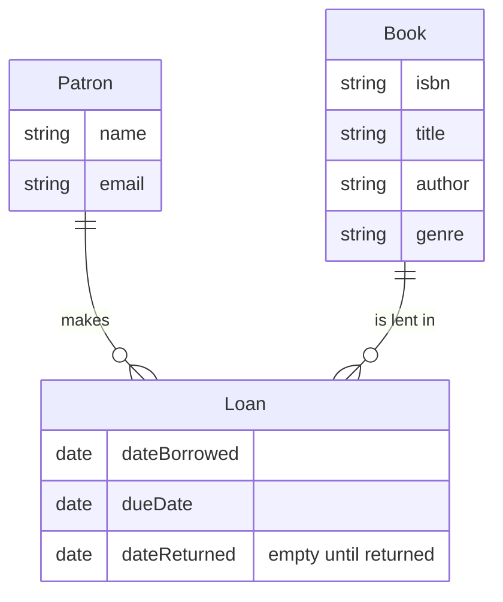

# Library: logical ERD

```mermaid
erDiagram
    Patron ||--o{ Loan : "makes"
    Book ||--o{ Loan : "is lent in"

    Book {
        string isbn
        string title
        string author
        string genre
    }
    Patron {
        string name
        string email
    }
    Loan {
        date dateBorrowed
        date dueDate
        date dateReturned "empty until returned"
    }
```
