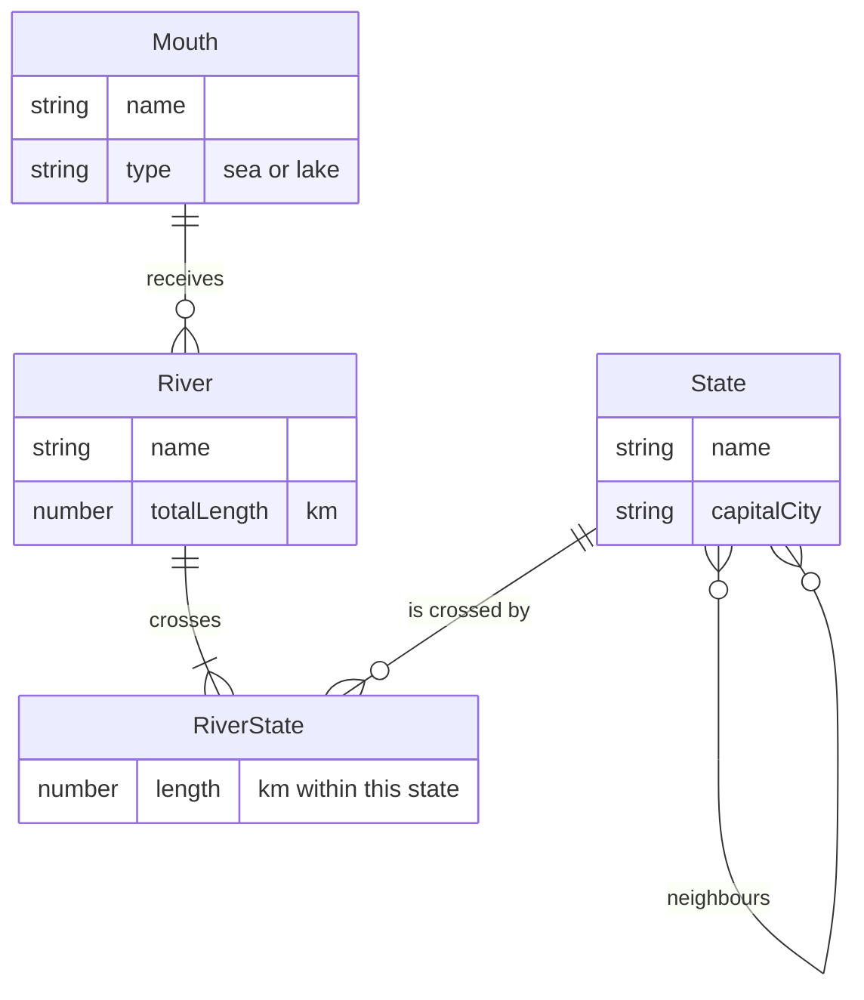

# Exercise 2.2: Rivers, logical ERD

```mermaid
erDiagram
    Mouth ||--o{ River : "receives"
    River ||--|{ RiverState : "crosses"
    State ||--o{ RiverState : "is crossed by"
    State }o--o{ State : "neighbours"

    River {
        string name
        number totalLength "km"
    }
    Mouth {
        string name
        string type "sea or lake"
    }
    State {
        string name
        string capitalCity
    }
    RiverState {
        number length "km within this state"
    }
```

Assumptions:

- Lengths are in kilometres.
- Every river recorded crosses at least one state.
- A mouth is either a sea or a lake, as the scenario says.
