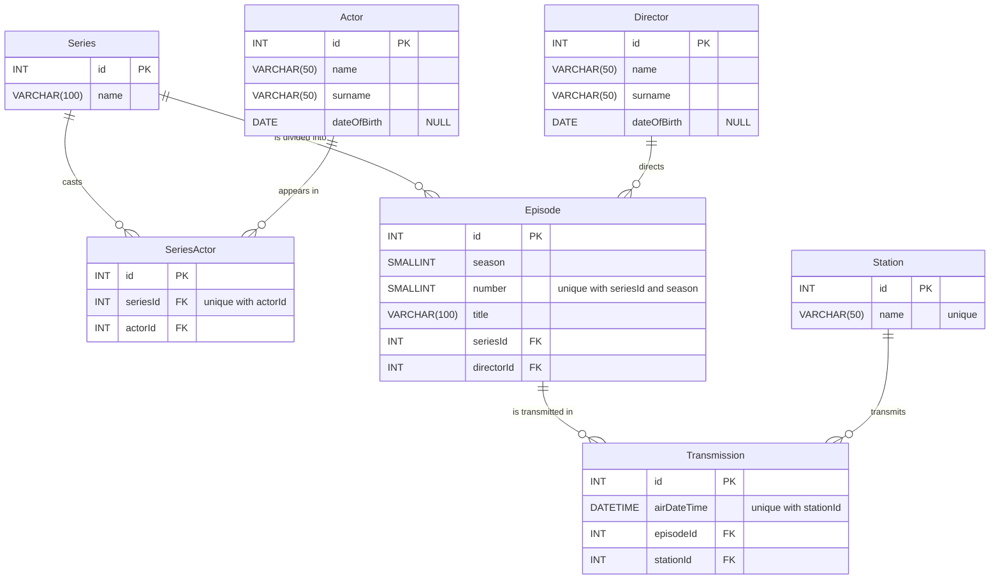

# Exercise 2.4: TV studio, physical ERD

```mermaid
erDiagram
    Series ||--o{ SeriesActor : "casts"
    Actor ||--o{ SeriesActor : "appears in"
    Series ||--o{ Episode : "is divided into"
    Director ||--o{ Episode : "directs"
    Episode ||--o{ Transmission : "is transmitted in"
    Station ||--o{ Transmission : "transmits"

    Series {
        INT id PK
        VARCHAR(100) name
    }
    Actor {
        INT id PK
        VARCHAR(50) name
        VARCHAR(50) surname
        DATE dateOfBirth "NULL"
    }
    SeriesActor {
        INT id PK
        INT seriesId FK "unique with actorId"
        INT actorId FK
    }
    Director {
        INT id PK
        VARCHAR(50) name
        VARCHAR(50) surname
        DATE dateOfBirth "NULL"
    }
    Episode {
        INT id PK
        SMALLINT season
        SMALLINT number "unique with seriesId and season"
        VARCHAR(100) title
        INT seriesId FK
        INT directorId FK
    }
    Station {
        INT id PK
        VARCHAR(50) name "unique"
    }
    Transmission {
        INT id PK
        DATETIME airDateTime "unique with stationId"
        INT episodeId FK
        INT stationId FK
    }
```

All columns are `NOT NULL` unless marked `NULL`. Every `id` is `AUTO_INCREMENT`.
